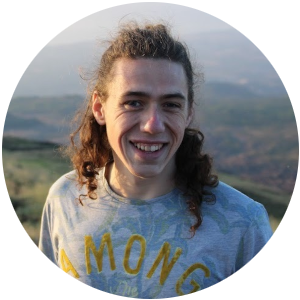

Working with students is one of the best parts of my job. Below you can find a bit of info about the great ones that I'm working with at the moment and ones I've worked with in the past.
## Current team members

### Yanis Hemeray

 Yanis is a student at Ecole Normale Supérieure and is working on a meta-analysis looking at the impacts of forest fires on ants.

 Yanis is a student at Ecole Normale Supérieure and is working on a meta-analysis looking at the impacts of forest fires on ants.

## Former team members

### Jasper Arendse

Jasper was a student at Vrije Universiteit Amsterdam and worked on an umbrella review of the impacts of precipitation increases and decreases on forest soil properties. We will use this work to build a large umbrella review, comparing multiple meta-analyses, to investigate the impacts of a wide range of disturbances on forest soils.

### Leo fisher

Leo was a student at UCL who worked on a systematic review investigating the impacts of precipitation increases and decreases on soil and litter invertebrates in forests. We are currently preparing this work for publication.

